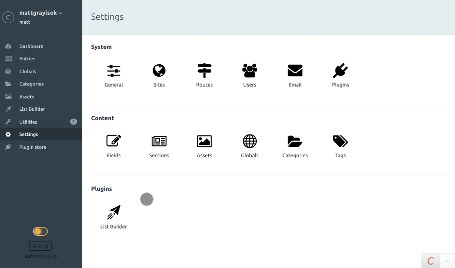

**This plugin works well up to Craft 3.3. Craft 3.4 made a lot of changes to document structure and styling in the control panel which broke a lot of stuff. Craft will soon be adding its own native dark mode and it's therefore unlikely this plugin will be updated to support Craft 3.4**

# Dark Mode plugin for Craft CMS 3.0 - 3.3

A Dark Mode for Craft CMS

## Requirements

This plugin requires Craft CMS 3.0.0 or later.

## Installation

Install via the Craft Plugin Store

OR

To install the plugin manually:

`composer require mattgrayisok/craft-dark-mode`

## Dark Mode Overview

Sometimes you just need a little less light and a little more shade.

Once installed all users will be able to toggle dark mode on and off using the switch in the main navigation.

## Supports Dark Mode

These plugins have added support for Dark Mode to provide you with a seamless experience throughout
the control panel:

* [Doxter](https://selvinortiz.com/plugins/doxter) - Beautiful Markdown Editor and Smart Parser for Craft CMS

## Plugin Developers

If your plugin adds custom elements to the control panel and you'd like to support Dark Mode
it couldn't be easier. Dark Mode adds the class `.darkmode` to the `body` tag when it is enabled,
simply add some additional styles to your plugin to take this into account.

## Dark Mode Roadmap

* Improve assets display. Might need to make some custom images
* ~~Get redactor styling to match~~
* ~~Allow dark mode to be [de]activated on a per-user basis using a switch in the nav~~

Brought to you by [Matt Gray](https://mattgrayisok.com)

---

Icon made by Freepik from https://www.flaticon.com/
